# Manual de uso ilustrado (con capturas)

**Sistema:** Gestor de Contraseñas de Servidores
**Audiencia:** todo el personal que usa el sistema.
**Alcance:** recorrido visual de las pantallas principales, paso a paso. Para la versión sin
capturas (más concisa) vea [`manual-usuario.md`](manual-usuario.md); para las tareas de
administración, [`manual-administrador.md`](manual-administrador.md).

> Las capturas corresponden al **frontend (Next.js)** en modo claro y usan **datos de ejemplo**
> (servidores, hipervisores y credenciales ficticios) para ilustrar la interfaz. Su instancia
> mostrará sus propios datos. La interfaz web clásica (Jinja) ofrece la misma funcionalidad con un
> aspecto equivalente.

---

## 1. Iniciar sesión

Abra la dirección del sistema en el navegador. El acceso se realiza en **tres etapas** —identidad,
verificación (MFA) y sesión—, indicadas en la barra de progreso inferior. Introduzca su **usuario**
y **contraseña** y pulse **Entrar**.

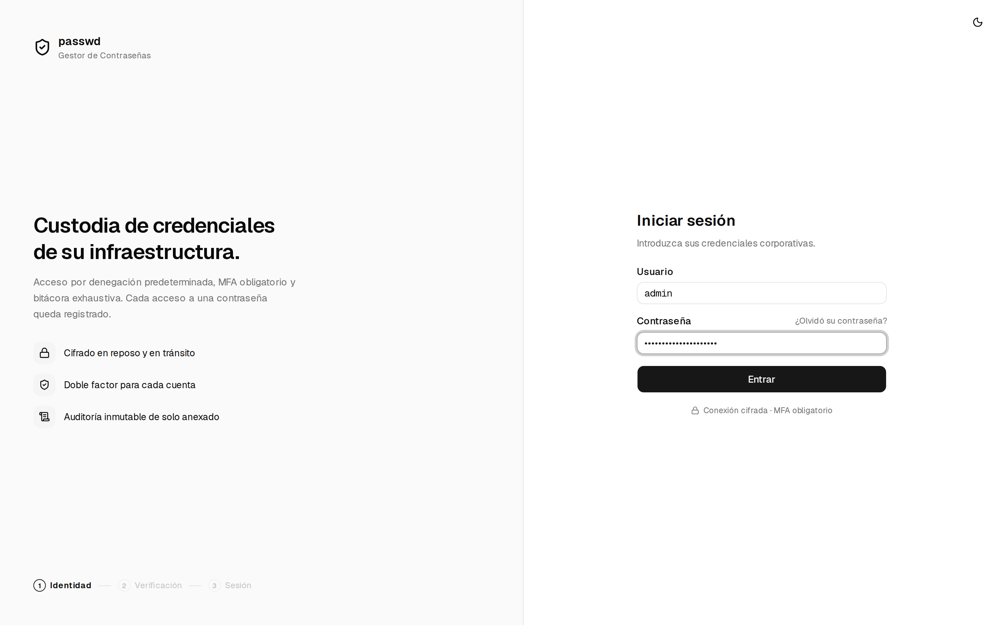

> Tras 5 intentos fallidos la cuenta se bloquea 15 minutos. Los mensajes de error son genéricos a
> propósito (no revelan si un usuario existe).

---

## 2. Cambio de contraseña (primer acceso)

La contraseña temporal que le entregó el administrador es de **un solo uso**. El sistema le pide
definir una nueva, que debe tener **mínimo 12 caracteres**, no ser común ni contener su usuario.

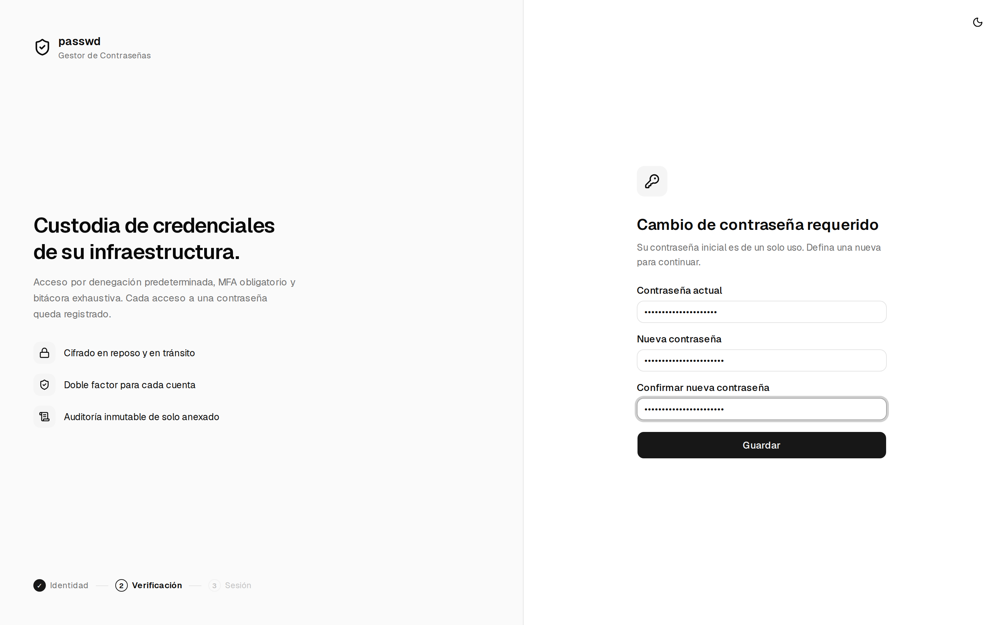

---

## 3. Enrolar el segundo factor (MFA)

El MFA es **obligatorio para todas las cuentas**. Escanee el **código QR** con su aplicación
autenticadora (Aegis, FreeOTP, Google/Microsoft Authenticator…) —o introduzca el secreto en modo
manual— y confirme el **código de 6 dígitos** que genera la app.

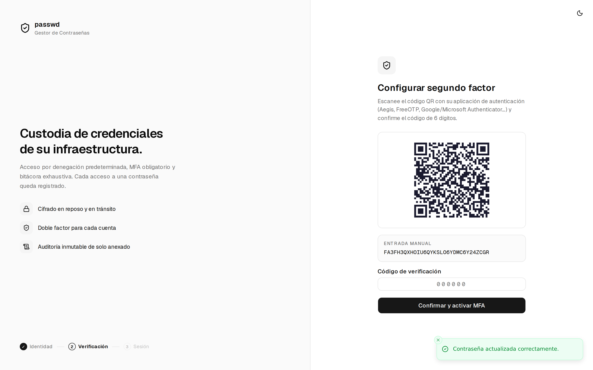

### Códigos de recuperación

Al activar el MFA, el sistema muestra **8 códigos de recuperación de un solo uso**. Permiten entrar
si pierde el dispositivo. **Se muestran una sola vez**: guárdelos en un lugar seguro antes de
continuar.

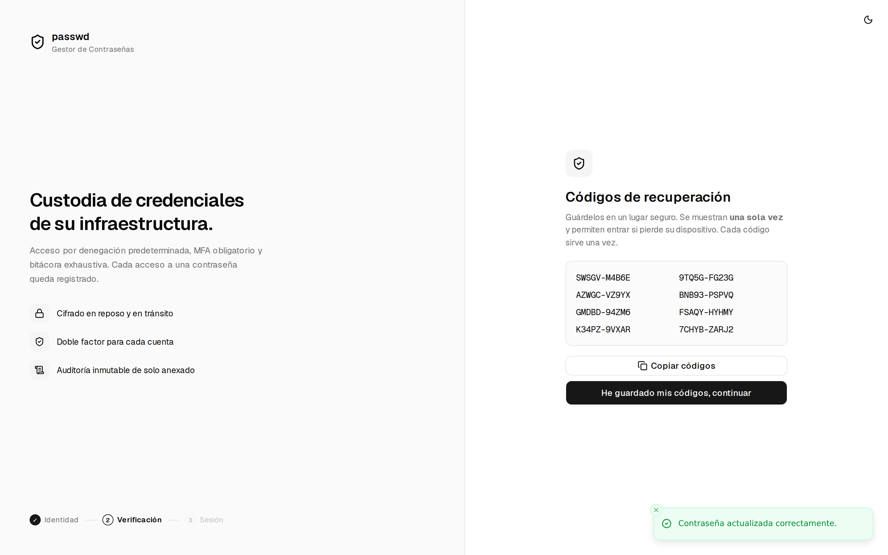

> En los accesos posteriores solo se le pedirá usuario + contraseña + el código de 6 dígitos (o,
> si no tiene el móvil, uno de los códigos de recuperación).

---

## 4. Inventario (panel principal)

Tras iniciar sesión llega al **Inventario**. De un vistazo verá:

- **Postura de seguridad**: cuántas credenciales requieren rotación, con un desglose «al día /
  por vencer / vencidas» y los totales de servidores, hipervisores, VMs y credenciales.
- **Cola de riesgo**: las credenciales más urgentes de rotar, ordenadas por antigüedad.
- **Lista del inventario**: servidores físicos e hipervisores (estos se despliegan para mostrar sus
  máquinas virtuales). El punto rojo y el fondo resaltado señalan activos con credenciales vencidas.

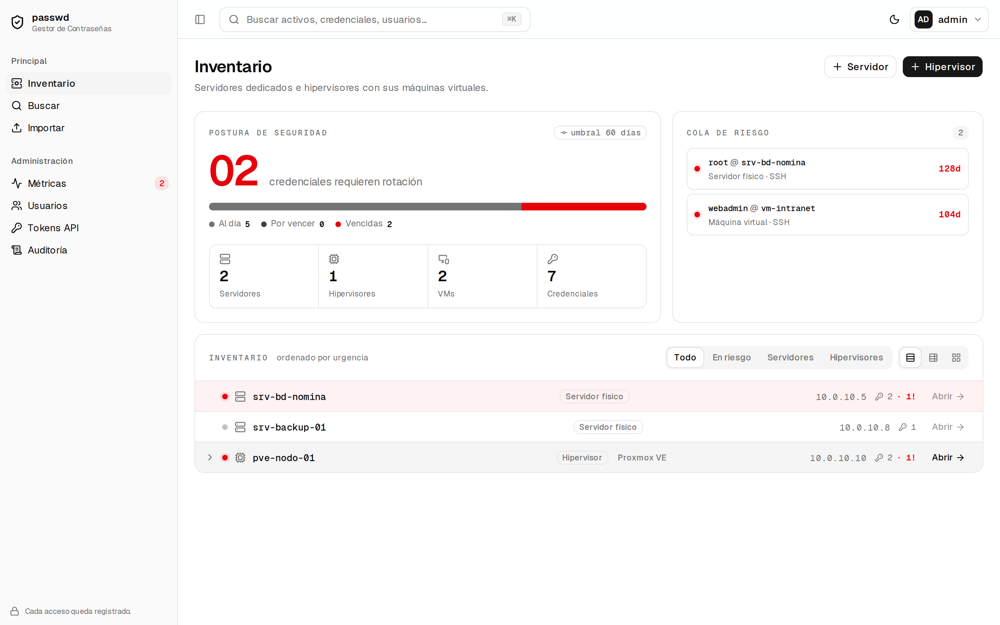

Use la barra superior para **buscar** (o pulse `Ctrl/⌘ + K`), cambiar de **tema** y abrir el menú
de usuario.

---

## 5. Ficha de un activo y uso de credenciales

Al abrir un activo verá sus datos (hardware, SO, IP de gestión, estado, etiquetas), sus
**credenciales**, la **nota segura** y —si es administrador— el panel de **control de acceso por
objeto**.

### Revelar / copiar una contraseña

- **📋 Copiar** envía la contraseña al portapapeles **sin mostrarla** y la borra a los 30 s.
- **Revelar** la muestra 30 s y luego la oculta sola.

En el ejemplo, la credencial `root` aparece marcada **«128 d · vencida»** con el botón **Rotar**, y
se ha pulsado *Revelar* (la contraseña se muestra en la caja inferior). **Cada revelado y cada
copiado quedan registrados en la bitácora.**

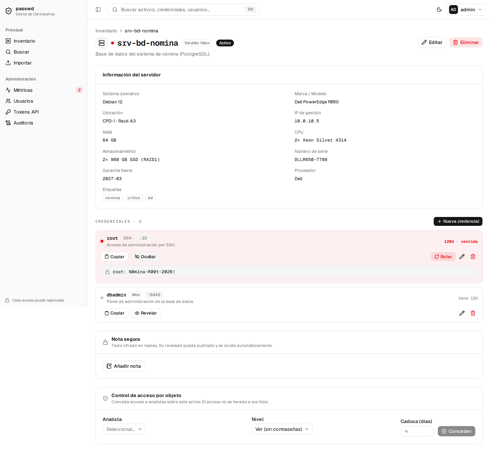

### Hipervisores y máquinas virtuales

La ficha de un hipervisor lista sus **máquinas virtuales** (con su estado) y sus credenciales de
gestión (iLO/IPMI, consola web…), además de su hardware.

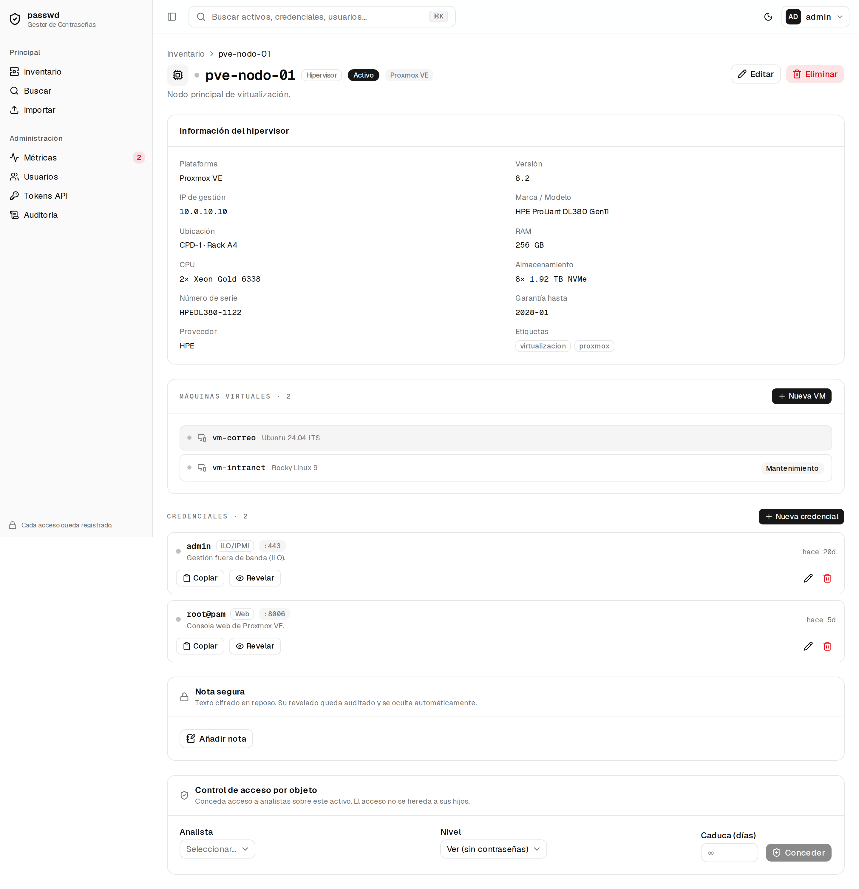

---

## 6. Crear o rotar una credencial

Desde la ficha de un activo, **+ Nueva credencial** abre el formulario: usuario de acceso,
servicio/protocolo, contraseña, puerto y descripción. El botón **Generar** crea una contraseña
aleatoria robusta de 20 caracteres. Al editar, dejar la contraseña en blanco la **conserva**;
introducir una nueva la **rota** (guardando la anterior en el historial).

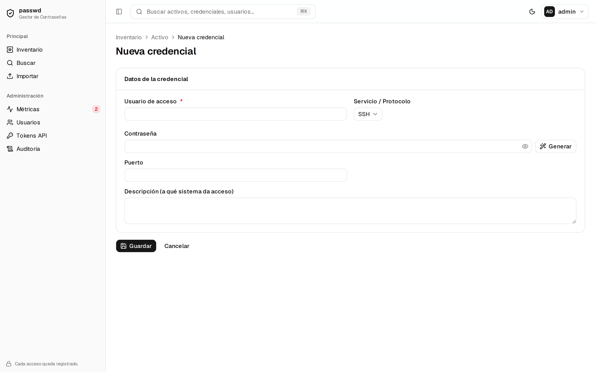

---

## 7. Búsqueda global

**Buscar** encuentra activos y credenciales por nombre, IP, usuario, servicio o etiqueta. Nunca
busca por contraseña, y un analista solo ve resultados de los activos que tiene concedidos.

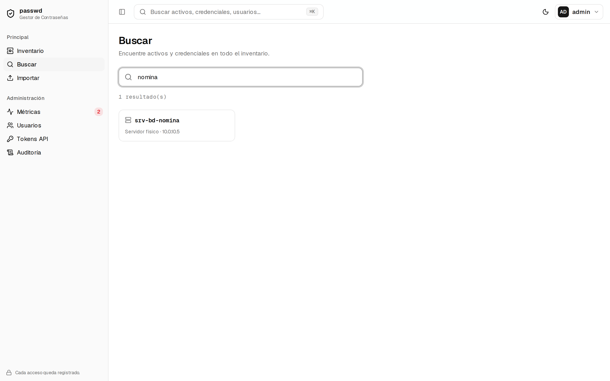

---

## 8. Pantallas de administración

> Visibles según el rol. Detalle de cada tarea en
> [`manual-administrador.md`](manual-administrador.md).

### Usuarios

Alta de cuentas, cambio de rol, desactivación y restablecimiento de contraseña/MFA. Las tarjetas
superiores resumen cuántas cuentas hay por rol.

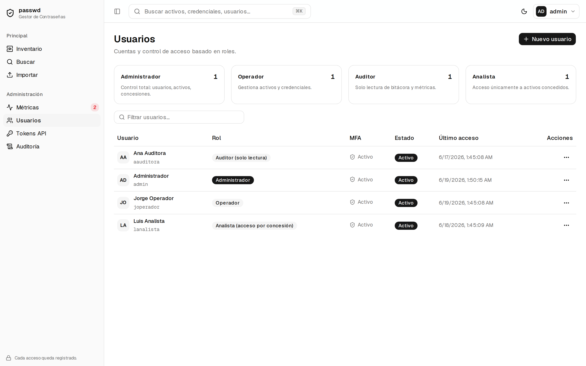

### Métricas de seguridad

Panel de apoyo a la revisión: logins fallidos (24 h / 7 d), rotación vencida, cuentas sin MFA,
usuarios bloqueados, top de accesos a credenciales y concesiones por caducar.

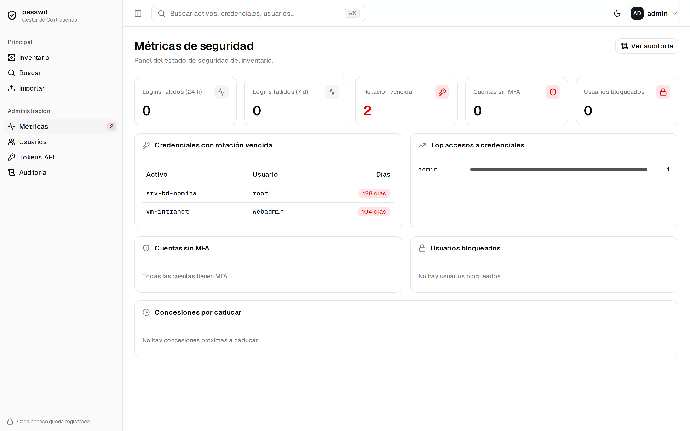

### Auditoría (bitácora)

Registro **inmutable de solo anexado** de cada acción, con usuario, IP, hora y resultado. Se puede
**filtrar** por usuario y acción y **exportar a CSV**.

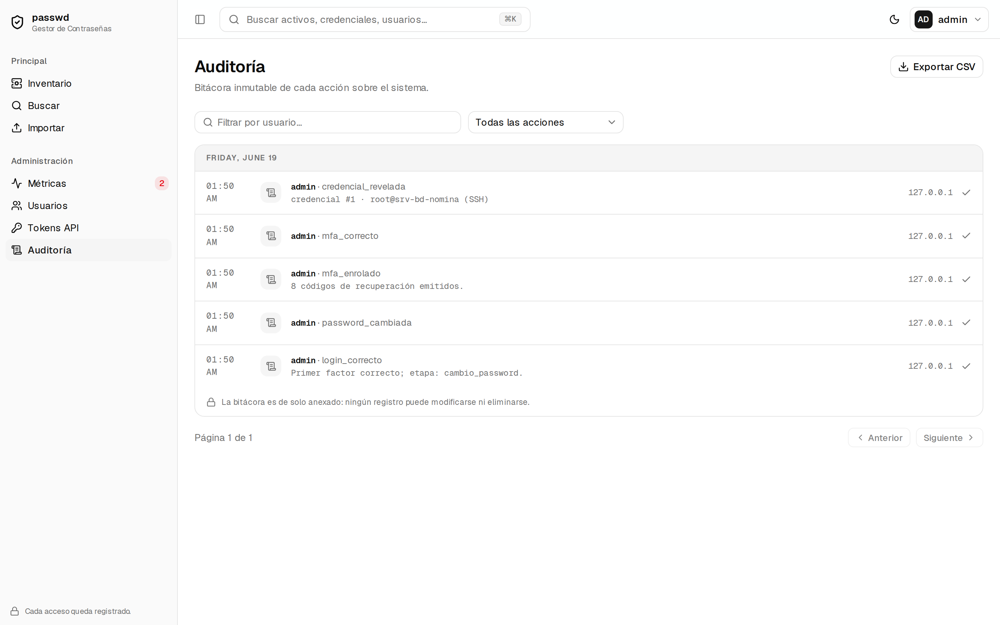

### Tokens de API

Creación y revocación de tokens **de solo lectura** para SIEM/automatización (API `/api/v1`). El
valor del token se muestra una sola vez. Referencia en
[`referencia-api-rest.md`](referencia-api-rest.md).

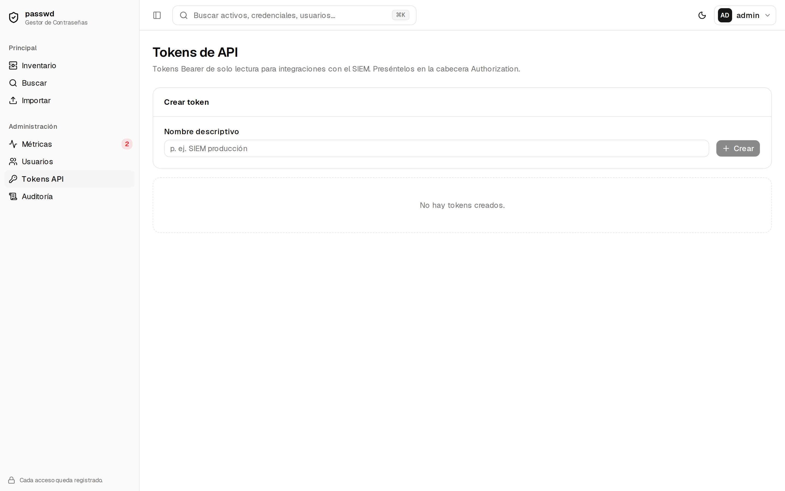

### Importación masiva por CSV

Carga de activos y credenciales desde un archivo CSV (procesado en memoria, cifrando al guardar);
los errores por fila no abortan la importación.

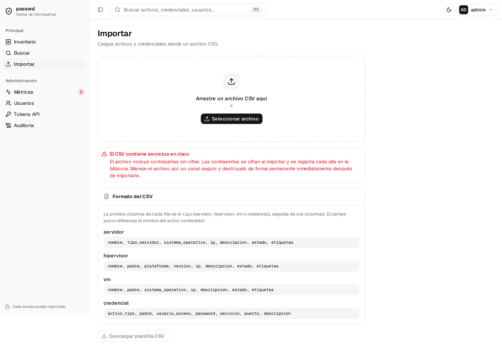

---

## 9. Tema claro / oscuro

El botón de tema (sol/luna) de la barra superior alterna entre modo claro y oscuro; la preferencia
se recuerda en el navegador.

---

## 10. Documentos relacionados

- [`manual-usuario.md`](manual-usuario.md) — manual de uso (versión sin capturas).
- [`manual-administrador.md`](manual-administrador.md) — tareas de administración.
- [`control-acceso.md`](control-acceso.md) — roles y concesiones por activo.
- [`README.md`](README.md) — índice de toda la documentación.
</content>
