# Modelo de datos relacional

## Jerarquía del inventario

La segmentación se modela con **dos activos de nivel superior** (servidor físico dedicado e
hipervisor) enlazados por claves foráneas. El hipervisor es la propia máquina física (con su
hardware) y aloja directamente sus máquinas virtuales:

```mermaid
erDiagram
    HIPERVISOR ||--o{ MAQUINA_VIRTUAL : "ejecuta"
    SERVIDOR_FISICO ||--o{ CREDENCIAL : "tiene"
    HIPERVISOR ||--o{ CREDENCIAL : "tiene"
    MAQUINA_VIRTUAL ||--o{ CREDENCIAL : "tiene"
    USUARIO ||--o{ SESION_WEB : "abre"
    USUARIO ||--o{ CREDENCIAL : "registró"
    USUARIO ||--o{ REGISTRO_AUDITORIA : "genera"
    USUARIO ||--o{ CODIGO_RECUPERACION_MFA : "posee"
    USUARIO ||--o{ CONCESION_ACCESO : "recibe (analista)"
    USUARIO ||--o{ ENTRADA_VAULT : "posee (vault personal)"
    SERVIDOR_FISICO ||--o{ CONCESION_ACCESO : "concedido"
    HIPERVISOR ||--o{ CONCESION_ACCESO : "concedido"
    MAQUINA_VIRTUAL ||--o{ CONCESION_ACCESO : "concedido"

    SERVIDOR_FISICO {
        int id PK
        string nombre UK
        text descripcion "sistema o funcion que cumple"
        string sistema_operativo
        string marca_modelo
        string ubicacion
        string ip_gestion
        string ram_cpu_almacenamiento "hardware"
    }
    HIPERVISOR {
        int id PK
        string nombre UK
        string plataforma "Proxmox, ESXi, Hyper-V..."
        string version
        string ip_gestion
        text descripcion
        string ram_cpu_almacenamiento "hardware propio"
    }
    MAQUINA_VIRTUAL {
        int id PK
        int hipervisor_id FK
        string nombre
        string sistema_operativo
        string ip
        text descripcion "sistema que corre"
        string ram "RAM asignada"
        string cpu "vCPU/nucleos asignados"
        string almacenamiento "disco asignado"
    }
    CREDENCIAL {
        int id PK
        int servidor_fisico_id FK "exactamente uno de los tres"
        int hipervisor_id FK
        int maquina_virtual_id FK
        string usuario_acceso
        bytes password_cifrada "Fernet AES"
        string servicio "SSH, RDP, iLO..."
        int puerto
        text descripcion
        int creado_por_id FK
        datetime password_rotada_en "alertas de rotacion"
    }
    CODIGO_RECUPERACION_MFA {
        int id PK
        int usuario_id FK
        string codigo_hash UK "SHA-256, un solo uso"
        datetime usado_en
    }
    ENTRADA_VAULT {
        int id PK
        int usuario_id FK "dueño (privado)"
        string titulo
        string usuario_acceso
        bytes password_cifrada "Fernet AES"
        string url
        string categoria "servicio | aplicacion | cuenta | otro"
        text notas
        datetime password_rotada_en
    }
    USUARIO {
        int id PK
        string username UK
        string email UK
        string password_hash "Argon2id"
        string rol "admin | operador | auditor | analista"
        bytes totp_secret_cifrado
        bool mfa_habilitado
        bool activo
    }
    CONCESION_ACCESO {
        int id PK
        int usuario_id FK "analista"
        int servidor_fisico_id FK "exactamente uno de los tres"
        int hipervisor_id FK
        int maquina_virtual_id FK
        string nivel "ver | ver_credenciales"
        int concedido_por_id FK "admin"
        datetime expira_en "caducidad opcional"
    }
    SESION_WEB {
        int id PK
        string token_hash UK "SHA-256"
        int usuario_id FK
        string etapa "cambio_password | mfa_enrolamiento | mfa_pendiente | activa"
        datetime expira_en
        datetime revocada_en
    }
    REGISTRO_AUDITORIA {
        int id PK
        datetime fecha
        int usuario_id FK
        string accion
        string objeto_tipo
        string objeto_id
        text detalle
        string direccion_ip
        bool exito
    }
```

## Reglas de integridad

1. **Activos de nivel superior**: el servidor físico dedicado y el hipervisor son entidades
   independientes; el hipervisor es la propia máquina física (con su hardware) y no se anida
   bajo un servidor físico.
2. **Máquinas virtuales**: siempre pertenecen a un hipervisor (`hipervisor_id NOT NULL`).
3. **Credenciales**: restricción CHECK que exige exactamente **una** de las tres claves
   foráneas (`servidor_fisico_id`, `hipervisor_id`, `maquina_virtual_id`); imposible una
   credencial huérfana o ambigua.
4. **Borrado en cascada**: eliminar un servidor físico elimina sus hipervisores, las VMs
   de estos y todas las credenciales asociadas; eliminar un hipervisor hace lo propio con
   sus VMs y credenciales.
5. **Secretos**: `password_cifrada` y `totp_secret_cifrado` nunca contienen texto plano;
   `token_hash` impide reutilizar un volcado de BD para secuestrar sesiones.
6. **Auditoría**: `usuario_id` usa `ON DELETE SET NULL` y se conserva el `username`
   textual, de modo que la trazabilidad sobrevive a cualquier baja.
7. **Concesiones de acceso**: misma restricción CHECK de «exactamente un activo» que las
   credenciales, más `UNIQUE(usuario, activo)` (sin duplicados) y `nivel ∈ {ver,
   ver_credenciales}`. `ON DELETE CASCADE` desde el usuario y desde el activo: al eliminar
   cualquiera, sus concesiones desaparecen. No hay herencia entre niveles del inventario.
   Detalle del modelo de acceso en [`control-acceso.md`](control-acceso.md).
8. **Vault personal** (`ENTRADA_VAULT`): pertenece a **un** usuario (`usuario_id`,
   `ON DELETE CASCADE`) y es **privado** —solo el dueño la ve, edita y revela; ni el
   administrador accede a su contenido—. `password_cifrada` (Fernet) nunca en claro;
   `categoria ∈ {servicio, aplicacion, cuenta, otro}`. Es independiente del inventario:
   sirve para contraseñas de servicios, aplicaciones o cuentas propias. Se incluye en el
   respaldo cifrado, pero **nunca** en el export en claro de migración.
