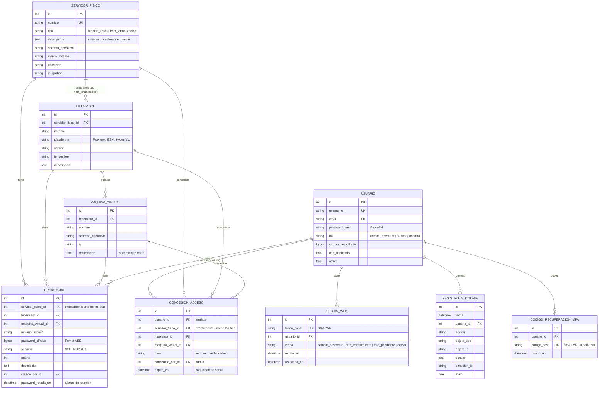

# Modelo de datos relacional

## Jerarquía del inventario

La segmentación pedida se modela con tres niveles enlazados por claves foráneas:

## Reglas de integridad

1. **Tipos de servidor físico**: `funcion_unica` (dedicado a un solo sistema) o
   `host_virtualizacion` (sin función única; aloja hipervisores). Restricción CHECK en BD
   y validación de negocio: no se pueden crear hipervisores bajo un servidor de función
   única, ni degradar a función única un servidor que tenga hipervisores.
2. **Máquinas virtuales**: siempre pertenecen a un hipervisor (`hipervisor_id NOT NULL`);
   un hipervisor siempre pertenece a un servidor físico (`servidor_fisico_id NOT NULL`).
3. **Credenciales**: restricción CHECK que exige exactamente **una** de las tres claves
   foráneas (`servidor_fisico_id`, `hipervisor_id`, `maquina_virtual_id`); imposible una
   credencial huérfana o ambigua.
4. **Borrado en cascada**: eliminar un servidor físico elimina sus hipervisores, las VMs
   de estos y todas las credenciales asociadas; eliminar un hipervisor hace lo propio con
   sus VMs y credenciales.
5. **Secretos**: `password_cifrada` y `totp_secret_cifrado` nunca contienen texto plano;
   `token_hash` impide reutilizar un volcado de BD para secuestrar sesiones.
6. **Auditoría**: `usuario_id` usa `ON DELETE SET NULL` y se conserva el `username`
   textual, de modo que la trazabilidad sobrevive a cualquier baja.
7. **Concesiones de acceso**: misma restricción CHECK de «exactamente un activo» que las
   credenciales, más `UNIQUE(usuario, activo)` (sin duplicados) y `nivel ∈ {ver,
   ver_credenciales}`. `ON DELETE CASCADE` desde el usuario y desde el activo: al eliminar
   cualquiera, sus concesiones desaparecen. No hay herencia entre niveles del inventario.
   Detalle del modelo de acceso en [`control-acceso.md`](control-acceso.md).
